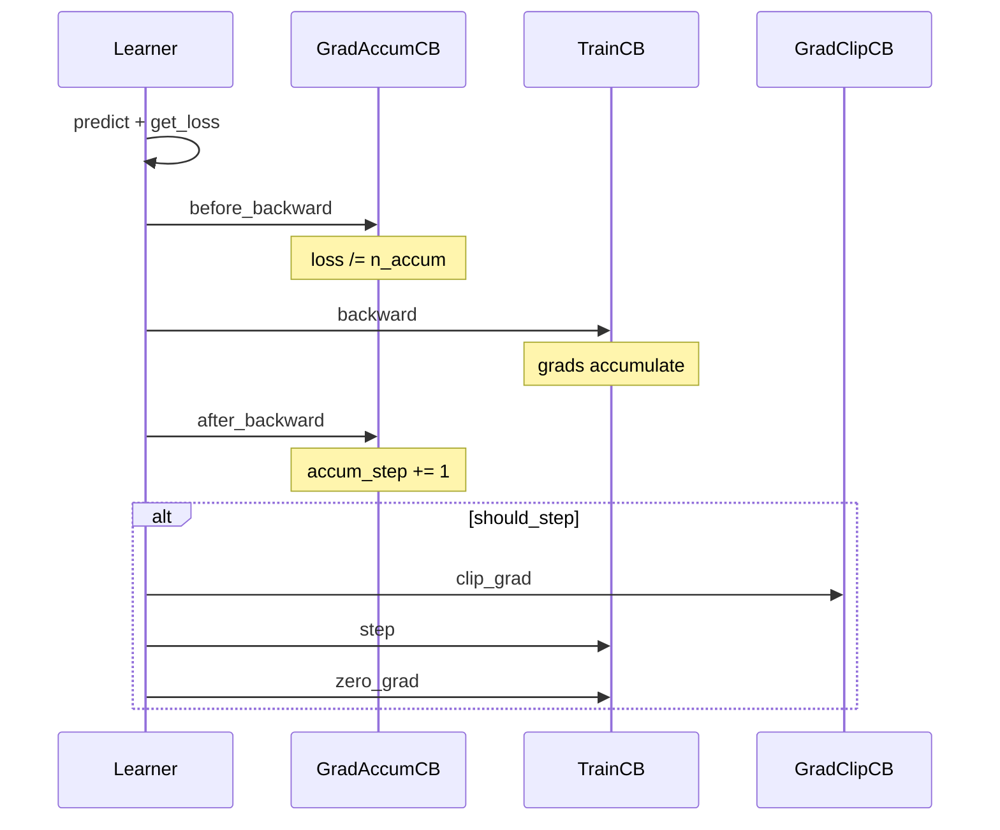

# Gradient accumulation

Used when training with `Learner` and you need a larger effective batch than fits in GPU memory. Read this before enabling `grad_accum` in Hydra or `default_cbs`.

## What it does

Gradient accumulation runs several **micro-batches** (forward + backward) before each **optimizer step**:

```
effective_batch_size = micro_batch_size × grad_accum
```

Example: `batch_size=32`, `grad_accum=4` → effective batch 128, but only 32 samples in memory per forward pass.

## Quick start

### Hydra CLI

```bash
# classification / DETR (TrainConfig)
uv run mltrain grad_accum=4 batch_size=32

# CLIP (FitConfig nested under fit)
uv run python -m odyssey.experiments.clip fit.epochs=100 fit.grad_accum=4
```

### Python

```python
from odyssey.training import Learner, default_cbs, TrainCB

learn = Learner(
    model, dls, loss_func, torch.optim.AdamW,
    lr=1e-3,
    cbs=default_cbs(train=TrainCB(), grad_accum=4),
)
learn.fit(10)
```

Or attach the callback directly:

```python
from odyssey.training import GradAccumCB

GradAccumCB(n_accum=4)
```

Set `grad_accum=1` (default) to disable.

## Train-step flow

Each training micro-batch goes through `Learner.one_batch`:



State on `learn` during training:

| Attribute | Meaning |
|---|---|
| `n_accum` | Micro-batches per optimizer step |
| `accum_step` | Micro-batches since last step |
| `should_step` | Whether this batch triggers step / clip / zero_grad |
| `steps_per_epoch` | Optimizer steps per epoch (`ceil(n_batches / n_accum)`) |

## Callback interactions

### `TrainCB`

Steps and zeroes gradients only when `learn.should_step` is true. Backward runs every micro-batch (unless AMP handles it).

### `GradClipCB`

Clips only on optimizer-step boundaries, after gradients from all micro-batches in the cycle are accumulated.

### `MixPrecisionCB`

Uses the same hook-based train step as `TrainCB` (no `one_batch` override). On CUDA:

1. `autocast` wraps each train batch
2. `scaler.scale(loss).backward()` on every micro-batch
3. On `should_step`: `unscale_` → `clip_grad` → `scaler.step` → `update`

Works together with `GradAccumCB` out of the box.

### Schedulers (`OneCycleLR`, etc.)

`Learner.fit` builds schedulers with **optimizer steps** per epoch, not micro-batches. Per-batch schedulers step in `after_optimizer_step` (after `opt.step()`), so they stay in sync with `GradAccumCB` and epoch-end tail flushes.

### LR finder

Use `grad_accum=1` during LR sweeps. Accumulation changes the step cadence and makes LR finder results unreliable.

## Partial epoch tail

When `len(dls.train) % n_accum != 0`, leftover gradients are flushed at `after_epoch` (`step_on_epoch_end=True` by default).

Loss is scaled by `1 / n_accum` on every micro-batch, so the final partial cycle is slightly under-scaled. This is acceptable for most workloads; disable tail stepping with `GradAccumCB(..., step_on_epoch_end=False)` if you prefer to drop the remainder.

## Config reference

| Setting | Default | Location |
|---|---|---|
| `grad_accum` | `1` | `TrainConfig`, `default_cbs(..., grad_accum=...)` |
| `n_accum` | `2` | `GradAccumCB(n_accum=...)` |
| `scale_loss` | `True` | Divide loss before backward |
| `step_on_epoch_end` | `True` | Flush partial accumulation at epoch end |

## Files

| Module | Role |
|---|---|
| [`training/callbacks.py`](../src/odyssey/training/callbacks.py) | `GradAccumCB`, hook-based `MixPrecisionCB` |
| [`training/learner.py`](../src/odyssey/training/learner.py) | `before_backward` / `after_backward`, `_optimizer_step`, scheduler steps |
| [`training/config.py`](../src/odyssey/training/config.py) | `TrainConfig.grad_accum` |
